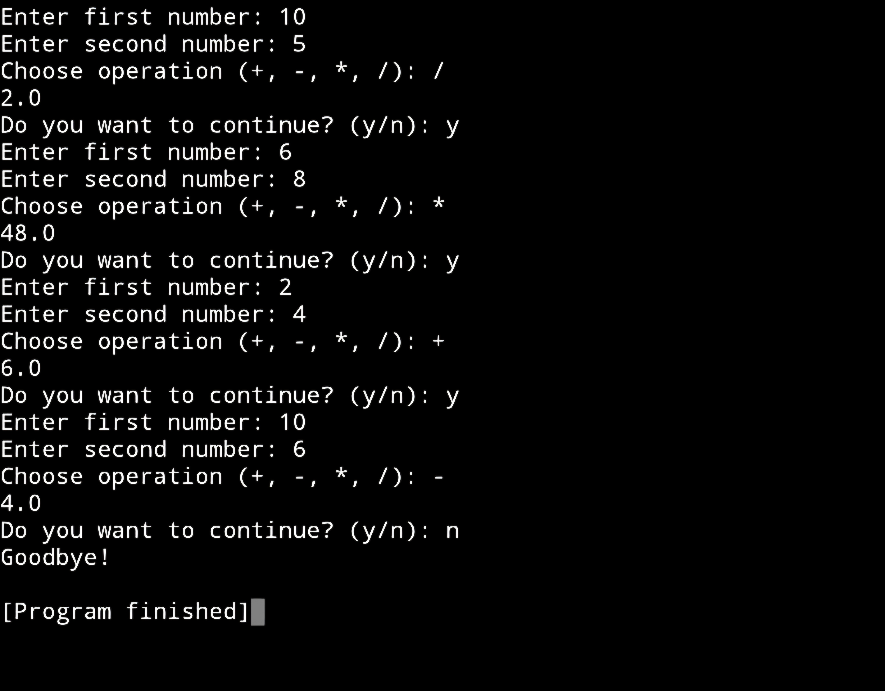

# Simple-python-calculator-
Console-based python Calculator supporting basic arithmetic operations, input validation, and loop-based interaction.
# Features 
-  Addition
-  Subtraction
-  Multiplication
-  Division (with zero handling)

# Output

